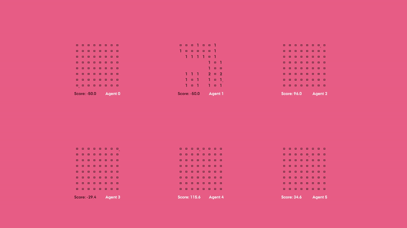

# MinesweeperML

This project is a Minesweeper game developed as part of a Games thesis project at the I.T. University of Copenhagen. It explores the capabilities of the ML-Agents Unity package by applying machine learning techniques to train agents to play Minesweeper. This project was developed in collaboration with fellow student [Hysse](https://github.com/Hysse).

## Overview

The MinesweeperML project is designed to serve as a learning and experimentation platform for using ML-Agents in Unity. The core focus of this project was to train agents to solve Minesweeper boards of varying complexity, exploring how reinforcement learning can be applied to classic puzzle games.

## Features

- **Example Scene (BaseScene)**: An example scene is provided, where multiple Minesweeper boards and agents are displayed, utilizing a pre-trained model. This scene serves as a demonstration of how the trained agents interact with the game environment. The agents previous move is denoted by a small square next to the chosen space.
  
- **Board Management**: The `BoardManager` (attached to the GameManager object) allows users to configure the size of the Minesweeper board and the number of mines. While the included models are trained specifically on 64-tile boards, this setting can be adjusted for experimentation purposes.

- **Customizable Rewards**: The `AgentAlphaOne` class provides the flexibility to set custom rewards for different actions taken by the agent. This enables fine-tuning of agent behavior to optimize learning outcomes.

- **Game Settings**: The `Game` class allows for detailed customization of individual board settings and reward structures. Users can modify various parameters, such as the reward for progress, scoring large flood clears, and more.

- **Visual Customization**: The `Board` class supports easy customization of the board's visual elements through ScriptableObjects. This allows for seamless adjustments to the game's aesthetic by altering the board's appearance across different runs.

- **Real-Time Decision Observation**: Notably, Agent 0 operates without a decision requester script, which enables viewers to observe the agent’s decision-making process in real-time, providing insights into how the model navigates the game.

## Potential Enhancements

- **Advanced Training Techniques**: Experimenting with more sophisticated training methods or additional models could further improve the performance and efficiency of the agents in solving Minesweeper puzzles.

- **Enhanced Visualization**: Adding more detailed visual feedback for the agent's decision-making process could help in better understanding the model's learning and actions.

## Usage

To explore the project, start by loading the `BaseScene`, where you can observe the trained agents in action on multiple Minesweeper boards. Adjust the board settings via the `BoardManager` to experiment with different board sizes and mine counts. Fine-tune the agent’s reward system using the `AgentAlphaOne` and `Game` classes to see how changes in incentives impact the agent's performance.